# RoleSync 🚀

> **A role-based recruitment platform that pairs technical candidates with startups through intelligent skill-matching, bulk job management, and streamlined application pipelines.**

[](https://nodejs.org/)
[](https://react.dev/)
[](https://tailwindcss.com/)
[](https://mongodb.com/)
[](https://redis.io/)

RoleSync breaks the mold of traditional, noisy job boards by leveraging asynchronous intelligent matchmaking, curated cultural alignment, and a seamless, high-fidelity user experience. Built with a deeply decoupled MERN architecture, it strictly separates the Candidate job-seeking journey from the complex Recruiter tracking suite.

---

## 🌟 Platform Architecture & Features

RoleSync is designed for scale, built on a modular, event-driven infrastructure.

### 🏛 Architecture Highlights
* **Decoupled Architecture:** Strict separation of concerns between the React Vite frontend and the Express REST API.
* **Asynchronous Matchmaking:** Heavy processing (AI-scoring, resume parsing) is offloaded to **Redis + BullMQ**, ensuring the Node.js event loop remains unblocked.
* **Optimized State Management:** Employs **TanStack React Query** for aggressive server-state caching and **Zustand** for lightweight client state mapping.
* **Premium UI/UX:** Driven by a strictly typed "Curated Editorial" design system utilizing Tailwind v4 **Glassmorphism**, dynamic typography, and highly responsive layouts.

### ⚙️ System Architecture Flow

```mermaid
flowchart LR
    %% Defines visual styles for blocks
    classDef user fill:#4f46e5,stroke:#3730a3,stroke-width:2px,color:#fff,rx:5px,ry:5px;
    classDef frontend fill:#0ea5e9,stroke:#0369a1,stroke-width:2px,color:#fff,rx:5px,ry:5px;
    classDef backend fill:#10b981,stroke:#047857,stroke-width:2px,color:#fff,rx:5px,ry:5px;
    classDef db fill:#f59e0b,stroke:#b45309,stroke-width:2px,color:#fff,rx:5px,ry:5px;
    classDef redis fill:#ef4444,stroke:#b91c1c,stroke-width:2px,color:#fff,rx:5px,ry:5px;

    %% --- Actors ---
    subgraph View ["🌐 User Layer"]
        direction TB
        C((Candidate)):::user
        R((Recruiter)):::user
    end

    %% --- Frontend App ---
    subgraph Client ["💻 React (Vite)"]
        direction TB
        UI[Glassmorphic UI]:::frontend
        Store[Zustand Client State]:::frontend
        Query[React Query Cache]:::frontend
    end

    %% --- Backend App ---
    subgraph Server ["⚙️ Node.js (Express)"]
        direction TB
        API[REST API Gateway]:::backend
        Auth{JWT Middleware}:::backend
        Logic[Business Controllers]:::backend
    end

    %% --- Data Layer ---
    subgraph Data ["🗄️ Persistence Stack"]
        direction TB
        DB[(MongoDB)]:::db
        Cache[(Redis Event Queue)]:::redis
        Task((BullMQ AI Workers)):::redis
    end

    %% --- Relationships ---
    %% User to Frontend
    C & R ==>|"HTTP Interaction"| UI
    UI -.->|"Local Auth"| Store
    UI -.->|"Fetch Data"| Query
    
    %% Frontend to Backend
    Query ==>|"Axios Requests"| API
    API -->|"Validates Cookie"| Auth
    Auth -->|"Passes Request"| Logic
    
    %% Backend to Database & Queues
    Logic <==>|"CRUD Operations"| DB
    Logic ==>|"Push Heavy Matchmaking Job"| Cache
    Cache <==>|"Consume & Process"| Task
    Task  ==>|"Write Async Result"| DB
```



### 🔥 Core Features
* **Dual-Portal System:** Bespoke dashboards tailored individually for Candidates and Recruiters.
* **Smart Application Pipeline:** Recruiters seamlessly handle application lifecycles (Review → Interview → Offer → Rejected).
* **Secure Enterprise Auth:** Stateless JWT architecture served exclusively over secure, HTTP-Only cookies to eliminate XSS vulnerabilities.

---

## 🛠 Tech Stack

| Domain | Technologies |
| :--- | :--- |
| **Frontend Setup** | React 19, TypeScript, Vite |
| **Styling Engine** | Tailwind CSS v4, Lucide React, Material Symbols |
| **State & Fetching** | Zustand, TanStack React Query v5, Axios |
| **Backend Core** | Node.js (v20+), Express.js 5.x |
| **Database & ODM**| MongoDB, Mongoose 9.x |
| **Background Jobs** | Redis, BullMQ, ioredis |
| **Security & Auth** | JWT, bcryptjs, Helmet, Express Rate Limit |
| **Logging & Ops** | Pino, Winston, Morgan |

---

## 🗂 Project Structure

The repository is modularly split into completely untethered `frontend` and `backend` services to enforce strict separation of concerns.

```text
RoleSync/
├── backend/
│   ├── src/
│   │   ├── config/          # Environment & DB configurations
│   │   ├── core/            # Middlewares (Auth, Error) & Logger
│   │   ├── modules/         # Domain-Driven structure
│   │   │   ├── admin/
│   │   │   ├── applications/
│   │   │   ├── auth/        # Express Routes & Controllers
│   │   │   ├── jobs/
│   │   │   ├── matching/
│   │   │   ├── notification/
│   │   │   └── users/
│   │   └── server.js        # Entry point
│   └── package.json
└── frontend/
    ├── src/
    │   ├── core/            # Global Layouts, Navbar, ProtectedRoutes
    │   ├── config/          # Axios configurations (api.ts)
    │   ├── pages/           # Page level components
    │   │   ├── Admin/
    │   │   ├── Auth/
    │   │   ├── Candidate/
    │   │   ├── Public/      # Landing Page (Glassmorphism)
    │   │   └── Recruiter/
    │   ├── store/           # Zustand Stores
    │   ├── App.tsx          # Router orchestration
    │   ├── index.css        # Tailwind v4 Theme & Utilities
    │   └── main.tsx
    ├── vite.config.ts
    └── package.json
```

---

## 🚀 Quick Start (Local Development)

### Quick Start Commands
```bash
# Clone the repository
git clone https://github.com/<your-username>/rolesync.git
cd rolesync

# Install dependencies (in both backend and frontend)
cd backend && npm install
cd ../frontend && npm install

# Set up environment variables
cp .env.example .env

# Start the development server (run in separate terminals)
cd backend && npm run dev
cd frontend && npm run dev
```

The API will be available at `http://localhost:5000/api/v1`.
The application will be available at `http://localhost:5173`.

### Environment Variables
Configure your backend `.env` file with these values:

| Variable | Description | Example |
|----------|-------------|---------|
| `PORT` | Server port | `5000` |
| `MONGODB_URI` | MongoDB connection string | `mongodb://localhost:27017/rolesync` |
| `JWT_SECRET` | Secret key for JWT signing | `your_jwt_secret_key` |
| `JWT_EXPIRE` | Token expiration duration | `15m` |
| `REDIS_HOST` | Redis Server IP | `127.0.0.1` |
| `REDIS_PORT` | Redis Server Port | `6379` |

---

## 📖 API Documentation

**Base URL:**
```
http://localhost:5000/api/v1
```

### Table of Contents
- [Authentication](#authentication)
- [Recruiter Endpoints](#recruiter-endpoints)
- [Candidate Endpoints](#candidate-endpoints)
- [Data Models](#data-models)
- [Error Handling](#error-handling)

### Authentication

RoleSync uses **JWT Bearer Token** authentication. After a successful login or registration, the server returns a JSON Web Token (and HTTP-Only cookies). Include this token in the `Authorization` header for all protected routes:

```
Authorization: Bearer <your_jwt_token>
```
> Tokens are time-limited. Re-authenticate if you receive a `401 Unauthorized` response.

---

### Recruiter Endpoints

#### 1. Register (Recruiter)
Create a new recruiter account.

| Property | Value |
|----------|-------|
| **Method** | `POST` |
| **URL** | `/auth/register` |
| **Auth** | None |
| **Content-Type** | `application/json` |

**Request Body:**
```json
{
  "firstName": "John",
  "lastName": "Doe",
  "email": "john.doe@company.com",
  "password": "SecurePass123",
  "role": "recruiter"
}
```

| Field | Type | Required | Description |
|-------|------|----------|-------------|
| `firstName` | `string` | Yes | User's first name |
| `lastName` | `string` | Yes | User's last name |
| `email` | `string` | Yes | Unique email address |
| `password` | `string` | Yes | Minimum 8 characters recommended |
| `role` | `string` | Yes | Must be `"recruiter"` |

**Success Response:** `201 Created`
```json
{
  "success": true,
  "token": "<jwt_token>",
  "user": {
    "_id": "...",
    "firstName": "John",
    "lastName": "Doe",
    "email": "john.doe@company.com",
    "role": "recruiter"
  }
}
```

#### 2. Login (Recruiter)
Authenticate an existing recruiter and receive a JWT.

| Property | Value |
|----------|-------|
| **Method** | `POST` |
| **URL** | `/auth/login` |
| **Auth** | None |
| **Content-Type** | `application/json` |

**Request Body:**
```json
{
  "email": "john.doe@company.com",
  "password": "SecurePass123"
}
```

| Field | Type | Required | Description |
|-------|------|----------|-------------|
| `email` | `string` | Yes | Registered email address |
| `password` | `string` | Yes | Account password |

**Success Response:** `200 OK`
```json
{
  "success": true,
  "token": "<jwt_token>"
}
```

#### 3. Post a Job
Create a single job listing (recruiter-only).

| Property | Value |
|----------|-------|
| **Method** | `POST` |
| **URL** | `/jobs` |
| **Auth** | Bearer Token (Recruiter) |
| **Content-Type** | `application/json` |

**Request Body:**
```json
{
  "title": "Frontend Engineer",
  "companyName": "TechCorp",
  "description": "Looking for a React expert.",
  "skills": ["React", "JavaScript", "TailwindCSS"],
  "experienceLevel": "Mid",
  "location": "Remote",
  "salaryRange": {
    "min": 90000,
    "max": 120000
  }
}
```

| Field | Type | Required | Description |
|-------|------|----------|-------------|
| `title` | `string` | Yes | Job title |
| `companyName` | `string` | Yes | Hiring company name |
| `description` | `string` | Yes | Job description |
| `skills` | `string[]` | Yes | Required skills array |
| `experienceLevel` | `string` | Yes | e.g., `"Junior"`, `"Mid"`, `"Senior"` |
| `location` | `string` | Yes | Job location or `"Remote"` |
| `salaryRange` | `object` | No | Contains `min` and `max` (numbers) |

**Success Response:** `201 Created`
```json
{
  "success": true,
  "job": {
    "_id": "...",
    "title": "Frontend Engineer",
    "companyName": "TechCorp",
    "postedBy": "<recruiter_id>",
    "createdAt": "2025-01-12T..."
  }
}
```

#### 4. Bulk Upload Jobs
Create multiple job listings in a single request (recruiter-only).

| Property | Value |
|----------|-------|
| **Method** | `POST` |
| **URL** | `/jobs/bulk` |
| **Auth** | Bearer Token (Recruiter) |
| **Content-Type** | `application/json` |

**Request Body:**
```json
[
  {
    "title": "Frontend Engineer",
    "companyName": "TechCorp",
    "description": "Looking for a React expert.",
    "skills": ["React", "JavaScript", "TailwindCSS"],
    "experienceLevel": "Mid",
    "location": "Remote",
    "salaryRange": { "min": 90000, "max": 120000 }
  },
  {
    "title": "Backend Engineer",
    "companyName": "TechCorp",
    "description": "Node.js API developer needed.",
    "skills": ["Node.js", "Express", "MongoDB"],
    "experienceLevel": "Senior",
    "location": "Hyderabad",
    "salaryRange": { "min": 110000, "max": 150000 }
  }
]
```
> The request body is a **JSON array** of job objects. Each object follows the same schema as [Post a Job](#3-post-a-job).

**Success Response:** `201 Created`
```json
{
  "success": true,
  "count": 2,
  "jobs": [ ... ]
}
```

---

### Candidate Endpoints

#### 5. Register (Candidate)
Create a new candidate account.

| Property | Value |
|----------|-------|
| **Method** | `POST` |
| **URL** | `/auth/register` |
| **Auth** | None |
| **Content-Type** | `application/json` |

**Request Body:**
```json
{
  "firstName": "Aravind",
  "lastName": "Pentaparthi",
  "email": "aravind212@gmail.com",
  "password": "Aravind123",
  "role": "candidate"
}
```

| Field | Type | Required | Description |
|-------|------|----------|-------------|
| `firstName` | `string` | Yes | User's first name |
| `lastName` | `string` | Yes | User's last name |
| `email` | `string` | Yes | Unique email address |
| `password` | `string` | Yes | Account password |
| `role` | `string` | Yes | Must be `"candidate"` |

**Success Response:** `201 Created`
```json
{
  "success": true,
  "token": "<jwt_token>",
  "user": {
    "_id": "...",
    "firstName": "Aravind",
    "lastName": "Pentaparthi",
    "email": "aravind212@gmail.com",
    "role": "candidate"
  }
}
```

#### 6. Login (Candidate)
Authenticate an existing candidate and receive a JWT.

| Property | Value |
|----------|-------|
| **Method** | `POST` |
| **URL** | `/auth/login` |
| **Auth** | None |
| **Content-Type** | `application/json` |

**Request Body:**
```json
{
  "email": "aravind212@gmail.com",
  "password": "Aravind123"
}
```

**Success Response:** `200 OK`
```json
{
  "success": true,
  "token": "<jwt_token>"
}
```

#### 7. Upload Resume / Update Profile
Update the authenticated candidate's profile with skills, experience, and a resume file.

| Property | Value |
|----------|-------|
| **Method** | `PATCH` |
| **URL** | `/profiles/me` |
| **Auth** | Bearer Token (Candidate) |
| **Content-Type** | `multipart/form-data` |

**Form Data Fields:**

| Field | Type | Required | Description |
|-------|------|----------|-------------|
| `Skills` | `text` | Yes | Comma-separated skills (e.g., `"Node.js, MongoDB, Express.js, React.js"`) |
| `Experience` | `text` | Yes | Years of experience (e.g., `"2"`) |
| `resume` | `file` | Yes | Resume file upload (PDF recommended) |

**Example cURL:**
```bash
curl -X PATCH http://localhost:5000/api/v1/profiles/me \
  -H "Authorization: Bearer <your_jwt_token>" \
  -F "Skills=Node.js, MongoDB, Express.js, React.js" \
  -F "Experience=2" \
  -F "resume=@/path/to/resume.pdf"
```

**Success Response:** `200 OK`
```json
{
  "success": true,
  "profile": {
    "_id": "...",
    "skills": ["Node.js", "MongoDB", "Express.js", "React.js"],
    "experience": 2,
    "resumeUrl": "/uploads/resumes/resume-<timestamp>.pdf",
    "user": "<user_id>"
  }
}
```

---

## 🗄 Data Models

### User
```
{
  _id:        ObjectId
  firstName:  String (required)
  lastName:   String (required)
  email:      String (required, unique)
  password:   String (required, hashed)
  role:       String (enum: "recruiter" | "candidate")
  createdAt:  Date
}
```

### Job
```
{
  _id:              ObjectId
  title:            String (required)
  companyName:      String (required)
  description:      String (required)
  skills:           [String]
  experienceLevel:  String (enum: "Junior" | "Mid" | "Senior")
  location:         String
  salaryRange:      { min: Number, max: Number }
  postedBy:         ObjectId (ref: User)
  createdAt:        Date
}
```

### Profile
```
{
  _id:        ObjectId
  user:       ObjectId (ref: User)
  skills:     [String]
  experience: Number
  resumeUrl:  String
  updatedAt:  Date
}
```

---

## 🛡 Error Handling

All error responses follow a consistent format:

```json
{
  "success": false,
  "error": "Error message describing what went wrong"
}
```

| Status Code | Description |
|-------------|-------------|
| `400` | Bad Request - Invalid input or missing required fields |
| `401` | Unauthorized - Missing or invalid JWT token |
| `403` | Forbidden - Insufficient role permissions |
| `404` | Not Found - Resource does not exist |
| `409` | Conflict - Duplicate resource (e.g., email already registered) |
| `500` | Internal Server Error |

---
*Architected and engineered with precision by the RoleSync Team.*
